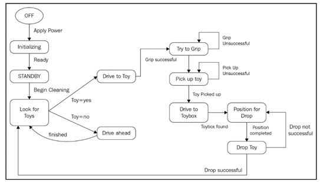

# 3.2.2.5 Что должен делать наш робот?

Теперь мы собираемся сделать некоторый подробный анализ того, что робот должен сделать, используя процесс раскадровки. Это работает так: мы берем каждую из наших двух задач и разбиваем их настолько, насколько можем, основываясь на ответах на все наши N вопросы. Затем мы делаем иллюстрацию каждого шага. Картинки могут быть рисунком или словесным образом \(абзацем\), описывающим, что происходит на этом шаге.

Мне нравится начинать процесс декомпозиции с описания робота в терминах конечного автомата, что для первой проблемы может быть хорошим подходом к пониманию происходящего. Вы, вероятно, знакомы с диаграммами конечных автоматов, но на всякий случай: диаграмма конечных автоматов описывает поведение робота как последовательность дискретных состояний или наборов условий, которые определяют, какие действия доступны роботу:

Наше первое состояние ВЫКЛ - у робота нет питания. Каждое состояние — это событие или события, которые вызывают изменение состояния. Это так называемые переходы. Чтобы перейти из выключенного состояния во что-то следующее, должно произойти какое-то событие - например, оператор-человек, включающий питание. Мы назовем это событие перехода примененной силой. Теперь, в каком мы состоянии? Требуется некоторое время для загрузки компьютера и загрузки программ \(инициализация\). Как только всё загрузится и инициализируется, робот будет готов к приему команд. Давайте назовем это состояние режим ожидания. Робот просто сидит в ожидании инструкций. Теперь мы хотим начать уборку комнаты. Я отправляю роботу команду «Начать очистку», которая изменяет состояние на -что? Что нам нужно делать дальше? Мы могли бы определить состояние, называемое очисткой, но оно охватывало бы множество сложных функций, что было бы для нас не очень хорошо. Нам нужен робот, ищущий вокруг себя игрушки для сбора. Если он не находит игрушку, ему нужно двигаться вперед, избегая препятствий, а затем снова посмотреть. Если он действительно находит игрушку, то ему нужно расположиться в пределах досягаемости руки робота, чтобы схватить игрушку. Поэтому на диаграмме конечного автомата мы добавляем переход «Начать очистку», который меняет состояние с “ожидание” на «поиск игрушек». Теперь мы можем добавить еще два перехода: один называется “Игрушка = нет”, а другой – “Игрушка = да”. Ветвь “Игрушка = нет” переходит в состояние, называемое “поездка”, где робот движется вперед, избегая препятствий, а затем возвращается в состояние «поиск игрушек» и снова пытается найти игрушку.

Итак, мы нашли игрушку, что нам теперь делать? Надо подъехать к игрушке так, чтобы рука робота находилась в радиусе действия. Мы пытаемся схватить игрушку за руку робота. Возможно, мы не добьемся успеха с первой попытки, и в этом случае мы просто попробуем еще раз. Переход цикла, который помечен как “Неудачный захват”, говорит, что вернитесь и попробуйте снова, если вы не добились успеха в первый раз. Где я слышал это раньше? То же самое можно увидеть в состоянии “Поднять игрушку”. Почему есть две части? Нам нужно сначала ухватиться за игрушку, прежде чем мы сможем ее поднять. Поэтому я подумал, что нужно два состояния, так как мы можем не справиться – игрушка выпадет из руки и не будет поднята, когда она слишком тяжелая или неудобная для подъема.

Хорошо, мы нашли игрушку и подняли ее. Что дальше? Нам нужно положить её в ящик для игрушек. Следующее состояние – “Поездка к корзине для игрушек”. Не беспокойтесь о “Как” на этом этапе; это как раз то, что нам нужно сделать. Позже мы можем разложить это состояние в более подробную версию. Мы едем, пока не достигнем события “Коробка для игрушек найдена”. Это означает, что мы видим ящик для игрушек. Затем мы переходим в состояние «Положение для опускания», которое перемещает робота в место, где он может уронить игрушку в коробку. Конечное состояние, “Отпустить игрушку”, самоочевидно. Мы бросили игрушку, робот не имеет ничего в своем захвате, и угадайте, что? Мы начнем с возвращения в состояние «Искать игрушки». Если робот решит, что падение не было успешным \(игрушка все еще находится в захвате\), тогда мы можем повторить этот шаг.

Это все хорошо, и наш маленький робот всегда ходит в поисках игрушек, верно? Мы пропустили два важных перехода. Нам нужно событие «Нет больше игрушек», и нам нужен способ вернуться в состояние ВЫКЛ. Добраться до ВЫКЛ легко - пользователь выключает питание. Я использую условный метод, когда блок помечается как любое состояние, поскольку мы можем нажать кнопку выключения в любое время, независимо от того, что еще делает робот, и робот ничего не может или не должен с этим поделать. Может быть более уместно провести линию из каждого состояния обратно в состояние ВЫКЛ, но это загромождает диаграмму, и эта нотация все еще имеет смысл.

Новая схема конечного автомата выглядит следующим образом:

Давайте уделим минуту и поговорим о концепции «нет больше игрушек». Как мы это определяем? Для этого могут потребоваться некоторые эксперименты, но на данным этапе мы скажем, что если мы не нашли игрушку после 10 минут попыток, то мы согласны с тем, что игрушек больше нет. Позже мы можете настроить это время по мере необходимости. Вполне возможно, что 5 минут вполне достаточно для комнаты нашего размера. Обратите внимание, что событие «нет больше игрушек» может произойти только из состояния «Искать игрушки».

Мы упоминали, что роботу нужно избегать препятствий. Но у нас нет состояния под названием «Избегайте препятствий». Почему? Это связано с тем, что некоторые из существующих состояний включают в себя “ехать”, и каждое из них включает избегание препятствий. Было бы неуместно иметь состояние для избегания препятствий, поскольку оно не является уникальным для одного состояния. Нам нужен отдельный конечный автомат, описывающий движение робота. Как я уже упоминал в разделе в предыдущей главе об архитектуре подчинения, мы можем одновременно выполнять более одной задачи. Цель "zz" - миссия, которая является общей целью робота. Избегать препятствий - это цель приводного двигателя, управления среднего уровня нашего робота.

